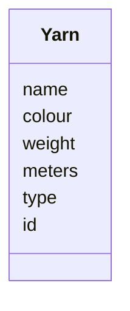
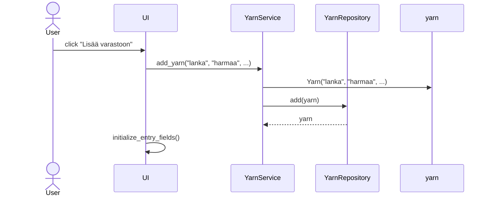

# Arkkitehtuurikuvaus

## Rakenne

Sovelluksen rakenne kuvattuna luokka/pakkauskaaviona:

Sovelluksen käyttöliittymästä vastaa hakemisto ui ja sovelluslogiikasta vastaava koodi löytyy hakemistosta services. Repositories-hakemisto sisältää koodin, joka huolehtii tietokantaoperaatioista ja entities sisältää luokan, joka kuvaa sovelluksen tietokohdetta.

## Sovelluslogiikka

YarnService-luokka vastaa sovelluksen toiminnallisuuksien toteutuksesta. Luokka sisältää metodeita, joita käyttöliittymän luokat kutsuvat. YarnService-luokka vastaa käyttäjän syöttämien tietojen validoimisesta ja eteenpäin välittämisestä YarnRepository luokalle. YarnService-luokka hakee tietoja tietokannasta YarnRepository-luokan kautta.

Sovelluksen ainoa tietokohde on luokka Yarn, joka kuvaa käyttäjän lisäämää lankaa.

## Käyttöliittymä

Sovelluksessa on 5 eri näkymää:
- Päävalikko, joka avautuu, kun sovellus käynnistetään
- Langan lisääminen
- Lankojen listaus ja poistaminen/muokkaus
- Lankojen haku
- Varastotilanne

Luokka UI vastaa sovelluksen käyttöliittymän eri näkymistä. Sovelluksen eri näkymät ovat jaettu omiin tiedostoihinsa ja luokkiinsa. Käyttöliittymän luokat kutsuvat luokan YarnService metodeja, jotka vastaavat sovelluslogiikasta.

## Tietojen tallennus

Tietojen tallentamisesta huolehtii repositories hakemistossa oleva luokka YarnRepository. Tiedot tallennetaan SQlite-tietokantaan. Tietokanta sisältää yhden taulun yarns, johon tallennetaan kaikki yhteen lankaan liityvät tiedot.

## Toiminnallisuudet

Uuden langan lisäämistä kuvaava sekvenssikaavio:

