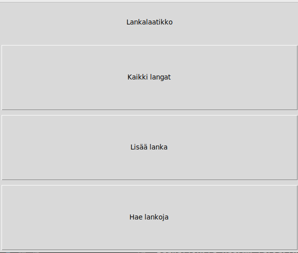
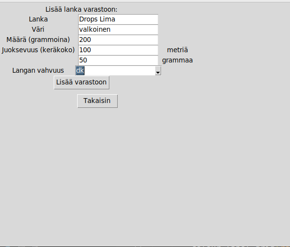
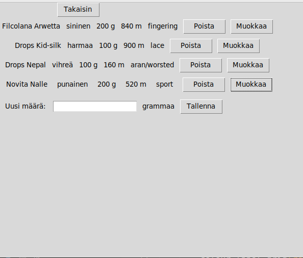
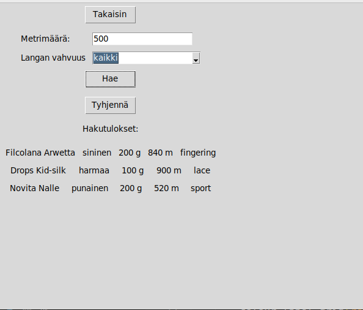

# Käyttöohje

## Päävalikko

Kun sovellus käynnistetään aukeaa näkymä päävalikkoon:

Päävalikosta voi siirtyä kolmeen eri näkymään:
- "Kaikki langat"
- "Lisää lanka"
- "Hae lankoja"

## Langan lisääminen

Päävalikosta pääsee lisäämään uuden langan painamalla "Lisää lanka"-nappia.
Syötekenttiin täytetään langan tiedot: nimi, väri, määrä, juoksevuus ja vahvuus. Langan kokonaismetrimäärä lasketaan juoksevuuden perusteella. Painamalla "lisää lanka"-nappia, lanka lisätään varastoon, mistä käyttäjä saa vahvistuksen. Jos lisäys ei onnistu käyttäjä saa virheilmoituksen. Päävalikkoon voi palata painamalla "Takaisin"-nappia.

## Lankojen listaus, poistaminen ja muokkaus

Päävalikosta pääsee tarkastelemaan kaikkia varastoon lisättyjä lankoja painamalla "Kaikki langat"-nappia. Lankoja pystyy poistamaan painamalla langan vieressä olevaa "Poista"-nappia. Langan määrää voi muokata painamalla "Muokkaa"-nappia, jolloin näkymään aukeaa kenttä, johon voi syöttää uuden määrän grammoina. Päävalikkoon voi palata painamalla "Takaisin"-nappia.

## Lankojen hakeminen

Päävalikosta pääsee hakemaan lankoja painamalla "Hae lankoja"-nappia. Lankoja voi hakea kahdella hakuehdolla. Syötekenttiin laitetaan vähimmäismetrimäärä sekä langan vahvuus. Painamalla "Hae"-nappia ilmestyy hakuehtoja vastaavat tulokset.

