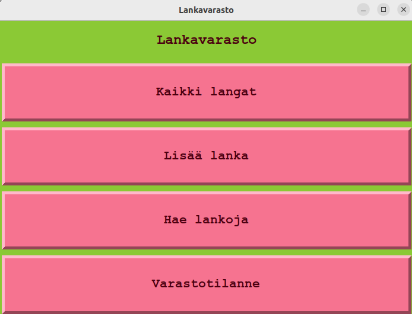
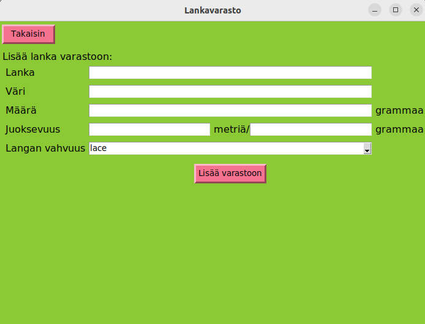
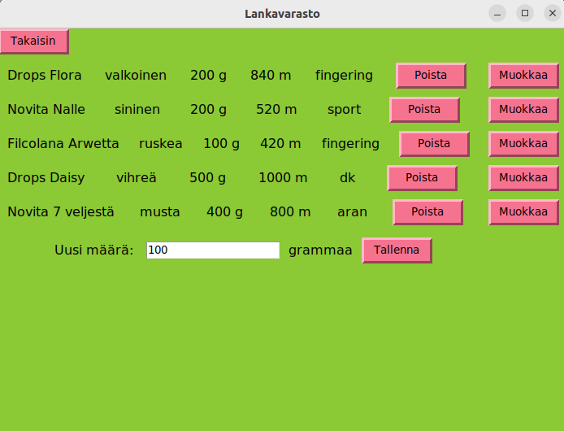
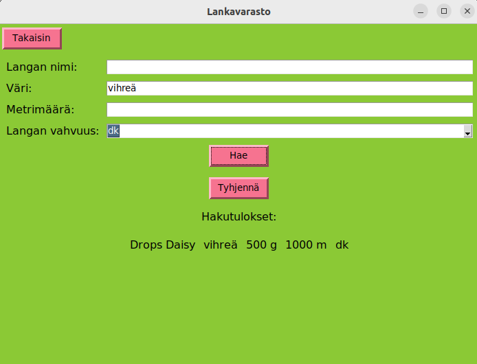
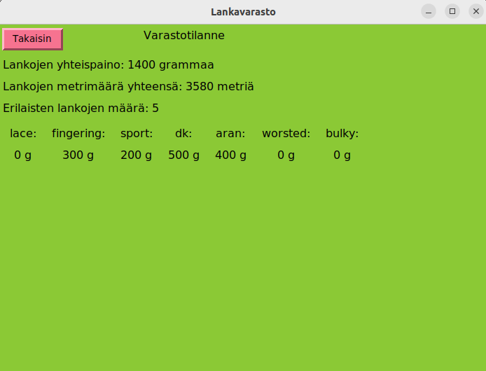

# Käyttöohje

## Sovelluksen asennus ja käynnistäminen

1. Riippuvuuksien asentaminen

```bash
poetry install
```

2. Tietokannan alustus

```bash
poetry run invoke build
```

3. Sovelluksen käynnistäminen

```bash
poetry run invoke start
```

## Päävalikko

Kun sovellus käynnistetään aukeaa näkymä päävalikkoon:



Päävalikosta voi siirtyä neljään eri näkymään:
- Kaikki langat
- Lisää lanka
- Hae lankoja
- Varastotilanne

## Langan lisääminen

Päävalikosta pääsee lisäämään uuden langan painamalla "Lisää lanka"-nappia.
Syötekenttiin täytetään langan tiedot: nimi, väri, määrä, juoksevuus ja vahvuus. Langan kokonaismetrimäärä lasketaan juoksevuuden perusteella. Painamalla "lisää lanka"-nappia, lanka lisätään varastoon, mistä käyttäjä saa vahvistuksen. Jos lisäys ei onnistu käyttäjä saa virheilmoituksen. Päävalikkoon voi palata painamalla "Takaisin"-nappia.



## Lankojen listaus, poistaminen ja muokkaus

Päävalikosta pääsee tarkastelemaan kaikkia varastoon lisättyjä lankoja painamalla "Kaikki langat"-nappia. Lankoja pystyy poistamaan painamalla langan vieressä olevaa "Poista"-nappia. Langan määrää voi muokata painamalla "Muokkaa"-nappia, jolloin näkymään aukeaa kenttä, johon voi syöttää uuden määrän grammoina. Päävalikkoon voi palata painamalla "Takaisin"-nappia.



## Lankojen hakeminen

Päävalikosta pääsee hakemaan lankoja painamalla "Hae lankoja"-nappia. Lankoja voi hakea erilaisilla hakuehdoilla. Painamalla "Hae"-nappia ilmestyy hakuehtoja vastaavat tulokset.



## Tietoja varastosta

Päävalikosta pääsee tarkastelemaan varaston tietoja painamalla "Varastotilanne"-nappia. Täältä voi katsoa esimerkiksi koko varaston lankojen määrän ja määrät langan vahvuuden mukaan.


