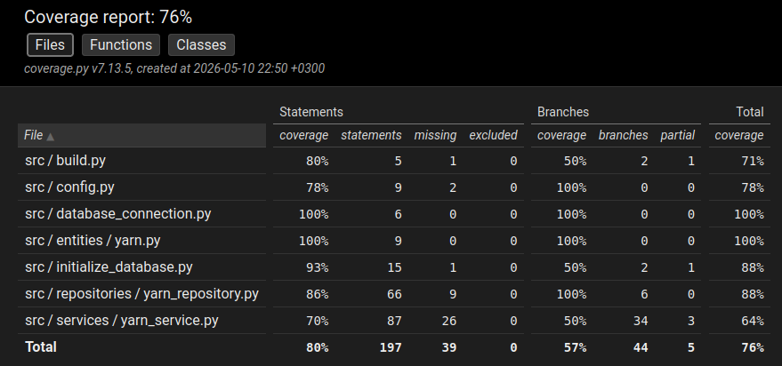

# Testausdokumentti

## Yksikkö- ja integraatiotestaus

### Sovelluslogiikka
 
 YarnService-luokan testausta varten on luotu TestYarnService-testiluokka. Testauksessa käytetään myös apuna FakeYarnRepository-luokkaa, joka tallentaa ja hakee tietoja tietokannan sijasta.

 ### Repositorio-luokka

 YarnRepository-luokkaa testataan TestYarnRepository-testiluokalla. Testaamisessa käytetty tietokanta on tallennettu omaan erilliseen tiedostoonsa.

 ### Testikattavuus

 Sovelluksen testauskattavuus on 76%.

 

 Käyttöliittymä on jätetty testauskattavuuden ulkopuolelle. Tiedostoja build.py ja initialize_database.py ei ole testattu.

 ## Järjestelmätestaus

 Järjestelmätestaus on tehty manuaalisesti.

 ### Asennus

 Sovellus on asennettu ohjeiden perusteella ja testattu Linux-ympäristössä.

 ### Toiminnallisuudet

 Sovelluksen tarjoamat toiminnallisuudet on testattu erilaisilla syötteillä.

 ## Testukseen jääneet puutteet

 YarnService-luokan testikattavuus jäi alhaisimmaksi, mutta tärkeimmät ominaisuudet on testattu.

